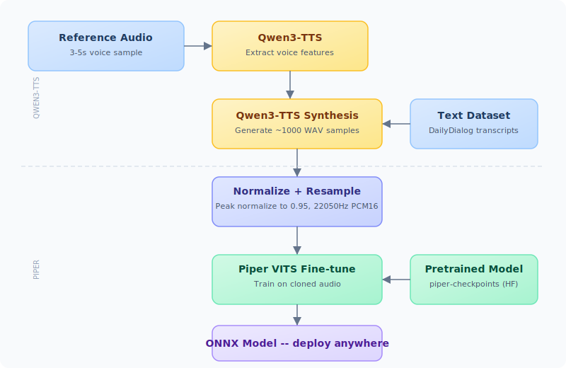

# qpclone

[](https://colab.research.google.com/github/whit3rabbit/qpclone/blob/main/Qwen3_TTS_Voice_Cloning_to_PIPER.ipynb)

Clone any voice from a 3-5 second audio sample into a fully offline Piper TTS model.

This is a single Google Colab notebook that chains Qwen3-TTS (voice cloning) into Piper (lightweight VITS) to produce a deployable `.onnx` model you can run on a Raspberry Pi, Home Assistant, or any device that supports [Piper TTS](https://github.com/rhasspy/piper).

## How it works

1. Upload a short voice clip (3-5 seconds, clean speech, one speaker)
2. Qwen3-TTS generates ~1000 synthetic training samples in that voice
3. A pretrained Piper VITS model is fine-tuned on those samples
4. You get an ONNX model file that speaks in the cloned voice -- completely offline

## Requirements

| What | Details |
|------|---------|
| Voice sample | Clean 3-5 second WAV or MP3. No background noise, single speaker. |
| Hugging Face token | Free account at [huggingface.co](https://huggingface.co/join). Create a token (Read access) at [Settings > Tokens](https://huggingface.co/settings/tokens). Add it as a Colab secret named `HF_TOKEN` (click the key icon in the sidebar, toggle notebook access on). |
| Google Drive | ~2-4 GB free space for project files |
| Colab GPU | T4 GPU (free tier works). `Runtime > Change runtime type > T4 GPU` |
| Time | ~6 hours total (2-3 hrs generation + 2-3 hrs training) |

## Quick start

1. Open the notebook in Google Colab
2. Edit the settings cells at the top (project name, language, sample count)
3. Run the cells in order -- upload your voice clip when prompted
4. Walk away. Everything after the upload is automated.
5. Find your `.onnx` model on Google Drive when it finishes

## Configuration

Key parameters (Cells 1-4):

| Parameter | Default | Description |
|-----------|---------|-------------|
| `PROJECT_NAME` | -- | Name for your voice project |
| `LANGUAGE` | English | Target language |
| `NUM_SAMPLES` | 1000 | Synthetic training samples (500-2000 recommended) |
| `PIPER_MAX_EPOCHS` | 1000 | Training duration |
| `PIPER_BATCH_SIZE` | 8 | Training batch size |
| `PIPER_PRETRAINED_CHECKPOINT` | `en/en_US/lessac/medium` | Pretrained model for fine-tuning. Set to `none` to train from scratch. |
| `QWEN_MODEL_ID` | 1.7B-Base | Qwen model size. 0.6B-Base uses less VRAM. |

### Pretrained checkpoints

Fine-tuning from a pretrained Piper checkpoint produces much better results with small datasets compared to training from scratch. The notebook auto-downloads the right checkpoint for your language from [rhasspy/piper-checkpoints](https://huggingface.co/rhasspy/piper-checkpoints).

Supported languages with checkpoints: English, Chinese, German, French, Russian, Portuguese, Spanish, Italian.

Japanese and Korean fall back to the English checkpoint (cross-language fine-tuning -- results may vary).

### Audio processing

Generated audio is:
- Resampled from 24kHz (Qwen output) to 22050Hz (Piper input)
- Peak-normalized to 0.95
- Saved as 16-bit PCM WAV

This prevents the "audio amplitude out of range" warnings that occur when Piper receives unnormalized float32 audio.

## Pipeline

<p align="center">
  
</p>

## Resume support

All progress is saved to `project.json` on Google Drive. If Colab disconnects:

- **Generation**: Picks up where it left off (skips already-generated samples)
- **Training**: Resumes from the last checkpoint automatically

## Project structure on Google Drive

```
Piper_Qwen_Projects/{project}/
  project.json          # persistent state
  reference/            # uploaded voice samples
  dataset/
    wavs/               # generated WAV training files
    metadata.csv        # LJSpeech format metadata
  piper/
    piper/              # cloned rhasspy/piper repo
    pretrained/         # downloaded pretrained checkpoint
  piper_training/
    training_runs/      # timestamped training output dirs
```

## Dependencies

Installed automatically by the notebook:

- [qwen-tts](https://github.com/QwenLM/Qwen3-TTS) -- voice cloning model
- [piper](https://github.com/rhasspy/piper) -- lightweight VITS TTS (archived Oct 2025, with compatibility fixes applied)
- pytorch-lightning 1.9.x -- pinned for Piper compatibility
- piper-phonemize (or piper-phonemize-cross for Python 3.12+)
- espeak-ng, sox -- system packages for phonemization and audio

## License

See individual model licenses:
- Qwen3-TTS: [Qwen License](https://github.com/QwenLM/Qwen3-TTS)
- Piper: [MIT License](https://github.com/rhasspy/piper)
